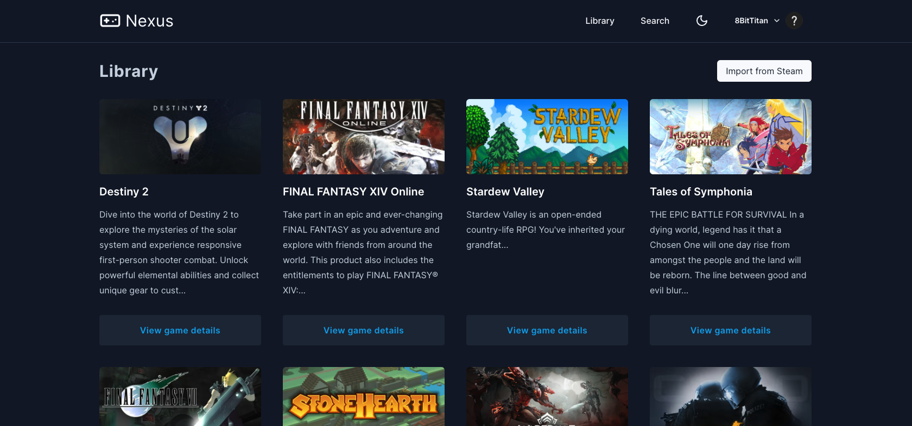
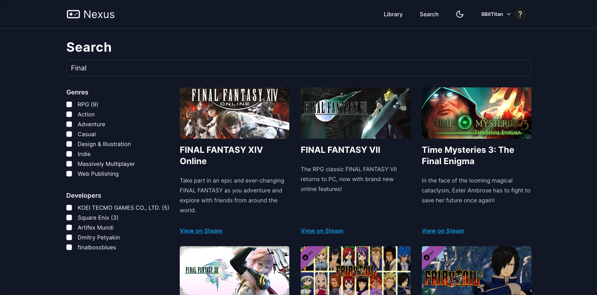

# NEXUS

A central hub to keep track of what games you have installed on Steam and find new ones through search.

Log in to Steam using OAuth and then import your library into Nexus. You can then get recommended games based on your library, or just search for new ones you might enjoy!

## Features

- Steam auth using [Remix Auth](https://github.com/sergiodxa/remix-auth)
- Light/Dark theme
- Search powered by [Algolia](https://algolia.com)
- Recommended games powered by [Algolia Recommend](https://www.algolia.com/products/recommendations/)

## Technologies used

[Remix](https://remix.run)

[Algolia Search](https://algolia.com)

[Tailwind](https://tailwindcss.com/)

[Prisma](https://www.prisma.io/)

## App preview

> App bootstrapped using [Screamo Stack](https://github.com/8bittitan/screamo-stack)
